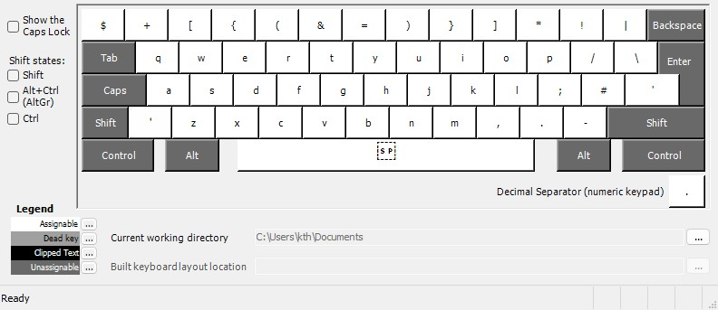
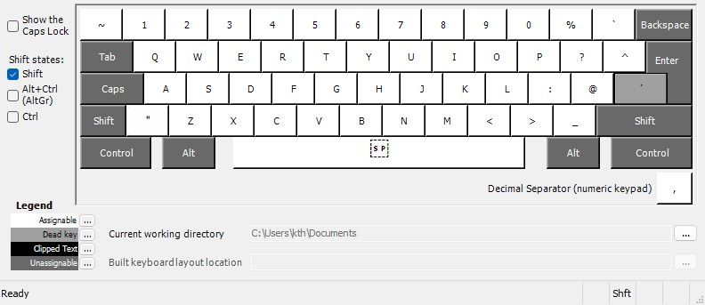

## Motivation
I was inspired by [Primegeans Real Programmer's Dvorak](https://github.com/ThePrimeagen/keyboards) to make an ISO/Danish compatible keyboard layout because the default Danish QWERTY layout is absolutely horrible for programming.

## Why QWERTY?
I feel like QWERTY does fine for typing English words.

## Preview

Base layer:

Shift layer:

